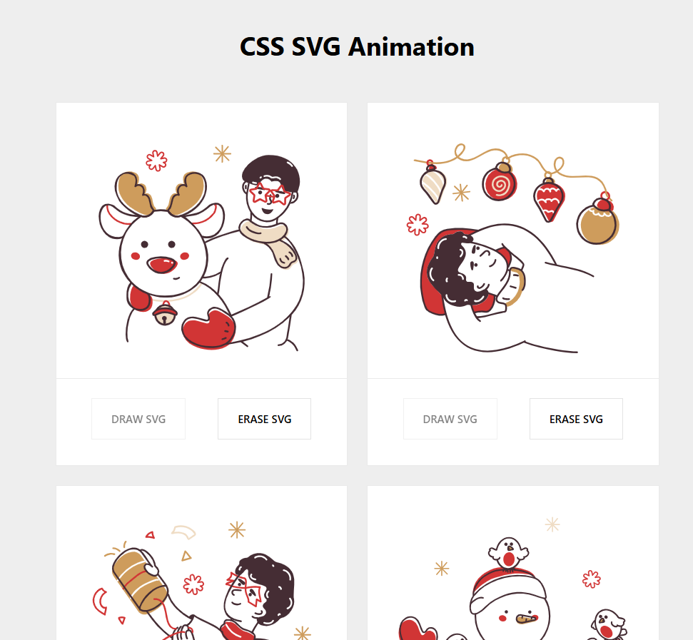

## Demo

[CSS SVG Animation](https://yt-pixelperfectlabs.github.io/css-svg-animation/)

## Preview

Here’s a preview of the **CSS SVG Animation**:

## Figma

[Christmas Dolty Illustrations](https://www.figma.com/community/file/1054803063018379087/christmas-dolty-illustrations).

## Online SVG Animation Tool

[SVG Artista](https://svgartista.net/).

## Tutorial

Watch the step-by-step implementation of this project on my YouTube channel:
[https://www.youtube.com/@PixelPerfectLabs](https://www.youtube.com/@PixelPerfectLabs).

## Support My Work

If you like this project and want to support my work, consider buying me a coffee!

> Your support helps me create more amazing UI/UX projects and tutorials. Thank you! 😊
